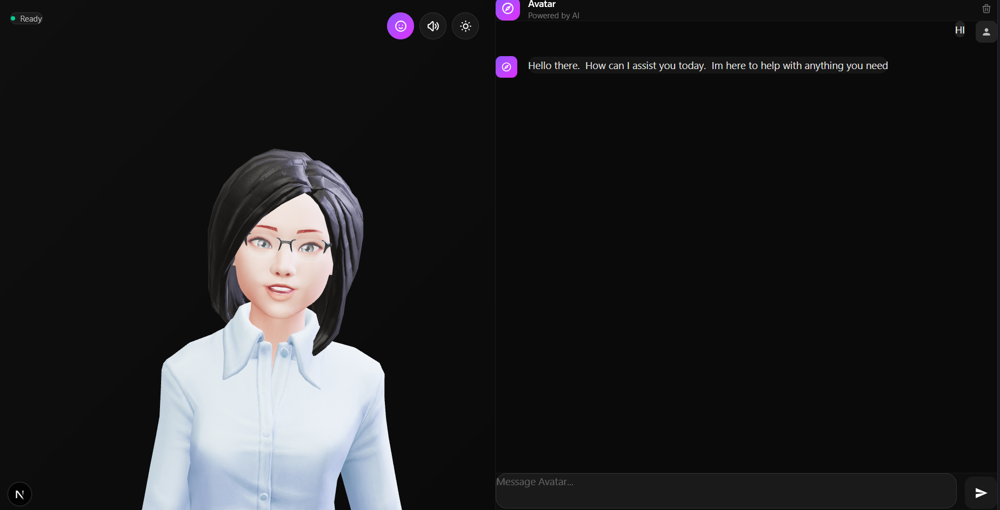

# Jenseira - AI-Powered Talking Avatar

> ✅ **Clean & Production Ready**



An interactive 3D avatar with AI-powered conversations, text-to-speech, and accurate lip-sync animation.

## ✨ Features

- 🤖 **AI Conversations** - Powered by Google Gemini 2.5 Flash
- 🎤 **Text-to-Speech** - High-quality voice synthesis with Supertonic
- 👄 **Lip Sync** - Accurate phoneme-based animation
- 🎭 **3D Avatar** - Interactive Ready Player Me avatars
- ⚡ **Real-time** - Fast response and smooth animations

## 🎯 Tech Stack

**Frontend:**
- Next.js 15 + TypeScript
- React 19
- Tailwind CSS v4
- Three.js + TalkingHead Library

**Backend:**
- Express.js + Node.js
- Google Gemini 2.5 Flash AI
- Supertonic TTS (HuggingFace)
- CMU Pronunciation Dictionary

## 🚀 Quick Start

**1. Setup Environment**
```bash
# Create .env file in backend directory
cd backend
echo "GEMINI_API_KEY=your_api_key_here" > .env
```

**2. Start Backend**
```bash
cd backend
npm install
npm start
```
Backend runs at `http://localhost:3001`

**3. Start Frontend (Next.js)**
```bash
cd frontend
npm install
npm run dev
```
Frontend runs at `http://localhost:3000`

**4. Open Browser**
Navigate to `http://localhost:3000` and start chatting with Jenseira!

## 🎮 Usage

1. Type your message in the input box
2. Press Enter or click Send
3. Jenseira responds with AI-generated speech and lip-sync

Features:
- AI-powered conversations using Gemini 2.5 Flash
- Real-time text-to-speech with accurate lip-sync
- Interactive animations and gestures
- Dark/Light theme toggle
- Mute/Unmute audio controls

## 🔌 API Endpoints

### POST /tts
Generate AI response with speech and lip-sync data

```bash
curl -X POST http://localhost:3001/tts \
  -H "Content-Type: application/json" \
  -d '{"text": "Hello!"}'
```

Response includes:
- AI-generated text response
- Audio data (Float32Array)
- Phonemes for lip-sync
- Duration timings

### GET /animation/stream
Server-Sent Events stream for real-time avatar animations

### GET /health
Health check

```bash
curl http://localhost:3001/health
```

## 📁 Project Structure

```
jenseira-live-chat/
├── backend/                    # Express.js API
│   ├── data/
│   │   └── cmudict.json       # Pronunciation dictionary
│   ├── routes/
│   │   ├── animation-stream.js # SSE for animations
│   │   ├── avatar.js          # Avatar commands
│   │   ├── llm.js             # LLM endpoint
│   │   └── tts.js             # TTS endpoint
│   ├── services/
│   │   ├── avatar.js          # Avatar service
│   │   ├── gemini.js          # Gemini AI
│   │   ├── tts.js             # TTS generation
│   │   └── phoneme.js         # Phoneme processing
│   ├── utils/
│   │   └── fastPhonemeDurations.js  # Duration estimation
│   ├── voices/                # Voice embeddings (F1, F2, M1, M2)
│   ├── server.js              # Express server
│   ├── .env                   # Environment variables
│   └── package.json
│
├── frontend/                   # Next.js 15 Frontend
│   ├── app/
│   │   ├── page.tsx           # Main page
│   │   ├── layout.tsx         # Root layout
│   │   └── globals.css        # Global styles
│   ├── components/
│   │   └── AvatarChat.tsx     # Main chat component
│   ├── hooks/
│   │   ├── useAvatar.ts       # Avatar hook
│   │   └── useChat.ts         # Chat hook
│   ├── lib/
│   │   ├── constants/
│   │   │   ├── config.ts      # Avatar config
│   │   │   └── visemes.ts     # Phoneme mapping
│   │   ├── services/
│   │   │   ├── api.ts         # API client
│   │   │   ├── avatar.ts      # Avatar loader
│   │   │   ├── avatar-controller.ts
│   │   │   ├── speech.ts      # Speech service
│   │   │   └── talkinghead-loader.ts
│   │   ├── types/
│   │   │   └── index.ts       # TypeScript types
│   │   └── utils/
│   │       ├── audio.ts       # Audio utilities
│   │       ├── viseme-converter.ts
│   │       └── word-timing.ts
│   ├── public/
│   │   └── avatars/
│   │       └── jenseira.glb   # 3D avatar model
│   └── package.json
│
├── assets/                     # Screenshots and media
├── docker-compose.yml          # Docker setup
├── .gitignore
└── README.md
```

## 🔄 Architecture

**Clean Separated Architecture:**
- ✅ Backend: Express.js REST API (Port 3001)
- ✅ Frontend: Static files (Port 3000)
- ✅ CORS enabled
- ✅ Modular structure
- ✅ Production ready

## 🛠️ Development

**Backend:**
```bash
cd backend
npm run dev
# Server auto-restarts with nodemon
```

**Frontend:**
```bash
cd frontend
npm run dev
# Next.js hot reload enabled
```

**Docker (Optional):**
```bash
docker-compose up
# Runs both frontend and backend
```

## ⚙️ Customization

### Change Voice
Edit `backend/services/tts.js`:
```javascript
const voiceBuffer = await fs.readFile("../voices/F1.bin"); // F1, F2, M1, or M2
```

### Change Avatar
Edit `frontend/lib/constants/config.ts`:
```typescript
export const AVATAR_CONFIG = {
  DEFAULT_AVATAR: '/avatars/jenseira.glb',
  BODY_TYPE: 'F',
  MOOD: 'neutral',
}
```

### Change AI Model
Edit `backend/services/gemini.js`:
```javascript
model: 'gemini-2.0-flash-exp'  // or gemini-1.5-pro, gemini-2.5-flash
```

### Customize System Prompt
Edit `backend/services/gemini.js`:
```javascript
systemPrompt: "You are a helpful assistant. Your name is Jenseira..."
```

## 📊 Performance

- **First load**: ~2s (avatar loading)
- **TTS generation**: ~2-3s
- **Lip sync**: Real-time, 60fps
- **Memory**: ~500MB (backend), ~200MB (frontend)

## 🚢 Deployment

**Using Docker:**
```bash
docker-compose up -d
```

**Manual Deployment:**

Backend:
```bash
cd backend
npm install --production
npm start
```

Frontend:
```bash
cd frontend
npm install
npm run build
npm start
```

Deploy frontend build to Vercel, Netlify, or any Node.js hosting platform.

## 🤝 Contributing

This is a clean, modular codebase. Feel free to:
- Add new voices
- Add new avatars
- Improve lip-sync accuracy
- Add new features

## 📄 License

ISC

## 👤 Author

aakashjammula
